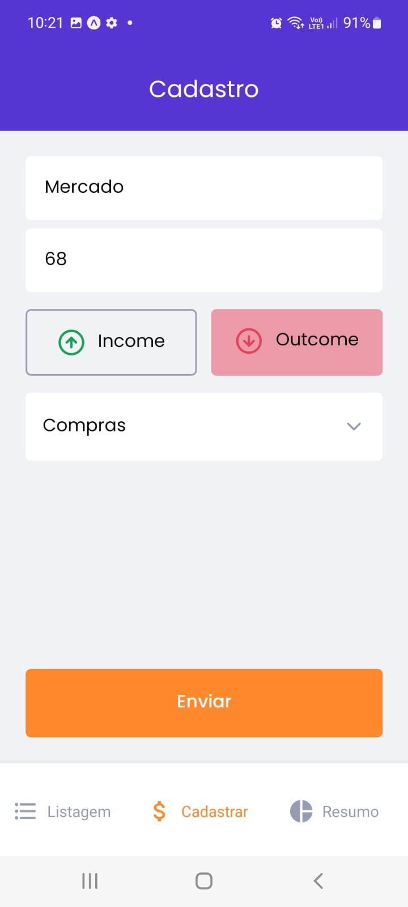
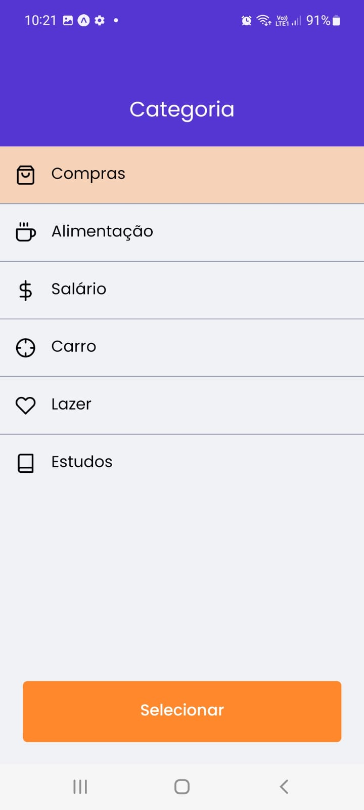
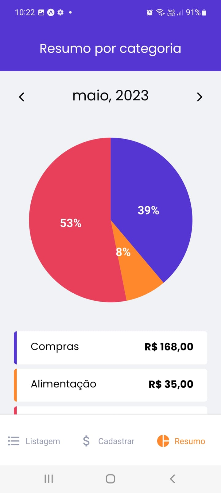

<h1 align="center">GOFINANCES</h1>

## Introdução

GOFINANCES é um aplicativo para gerenciamento financeiro de despesas, onde o usuário cadastra todas suas receitas e despesas por categorias e pode visualizar seus gastos mensais graficamente.

É um projeto que possuí o intuíto de aplicar os conceitos aprendidos no módulo 1 do curso Ignite React Native da Rocketseat versão 2021.

<div align="center">
  
  
  
  
  
</div>

## Requisitos

- Nodejs
- React Native cli
- Emulador Android Studio


## Tecnologias 

- React Native
- Typescript
- Styled Componentss
- Jest
- Testing Library
- TabNavigation
- StackNavigation
- Google auth
- Apple auth
- AsyncStorage
- Context


## Instalação

```sh
# Fazer o clone do projeto em uma máquina local
git clone https://github.com/marciovz/gofinances-mobile-ignite2021.git
```

```sh
# Acessa a pasta do projeto
cd gofinances-mobile-ignite2021
```

```sh
# Rodar a instalação das dependências do projeto
npm install
```

## Rodando a aplicação

Abrir o emulador ou conectar um dispositivo para rodar a aplicação

```sh
# Rodar o bundle da aplicação.
npx react-native start
```

```sh
# Rodar a aplicação
npx react-native run-android
```

## Melhorias

- Utilizar um banco de dados para armazenar as transações.
- Separar as transações pelo mes, evitando iterar muitos grandes.
- Implementar os testes da aplicação